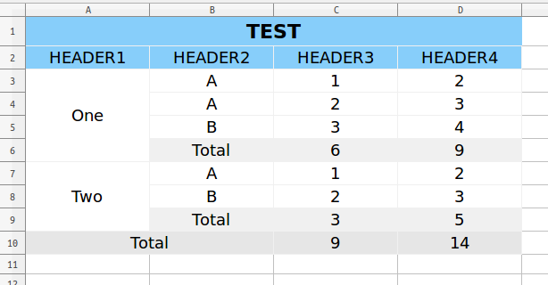

# tablereport


[](https://travis-ci.org/jefffffrey/tablereport)
[](https://coveralls.io/github/jefffffrey/tablereport?branch=master)
[](https://landscape.io/github/jefffffrey/tablereport/master)

A python library for making table report. Now supports exporting to Excel.

## Example

### Basic


```python
from tablereport import Table
from tablereport.shortcut import write_to_excel

table = Table(header=[['HEADER1', 'HEADER2', 'HEADER3', 'HEADER4']],
              body=[['One', 'A', 1, 2],
                    ['One', 'A', 2, 3],
                    ['One', 'B', 3, 4],
                    ['Two', 'A', 1, 2],
                    ['Two', 'B', 2, 3]])
write_to_excel('1.xlsx', table)
```

### Advanced



```python
from tablereport import Table, ColumnSelector, Style
from tablereport.shortcut import write_to_excel

table_style = Style({
    'horizontal_align': 'center',
    'vertical_align': 'center',
    'font_size': 12,
    'height': 'auto',
    'width': 'auto',
})

title_style = Style({
    'font_size': 15,
    'background_color': 'FF87CEFA',
    'font_weight': 'blod'
}, extend=table_style)

header_style = Style({
    'background_color': 'FF87CEFA',
}, extend=table_style)

left_total_style = Style({
    'background_color': 'fff0f0f0',
}, extend=table_style)


bottom_total_style = Style({
    'background_color': 'ffe6e6e6',
}, extend=table_style)


table = Table(header=[['TEST', None, None, None],
                      ['HEADER1', 'HEADER2', 'HEADER3', 'HEADER4']],
              body=[['One', 'A', 1, 2],
                    ['One', 'A', 2, 3],
                    ['One', 'B', 3, 4],
                    ['Two', 'A', 1, 2],
                    ['Two', 'B', 2, 3]],
              style=table_style)

table.header[0].set_style(title_style)
table.header[1].set_style(header_style)

areas = table.body.select(ColumnSelector(column=1, group=True))
areas.merge()
areas.add_summary(text_span=1, text='Total', location='left',
                  label_style=left_total_style,
                  value_style=left_total_style)

table.add_summary(text_span=2, text='Total', location='bottom',
                  label_style=bottom_total_style,
                  value_style=bottom_total_style)

write_to_excel('1.xlsx', table)
```