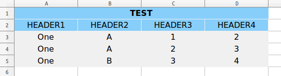
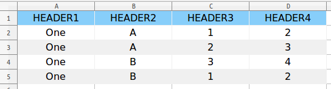
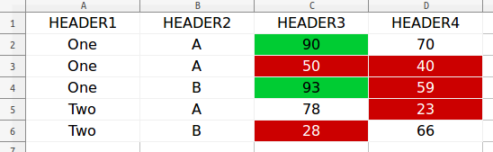
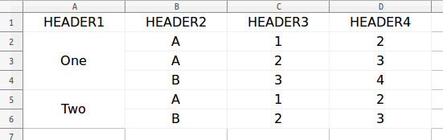
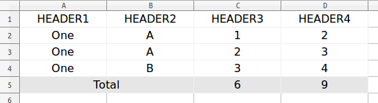
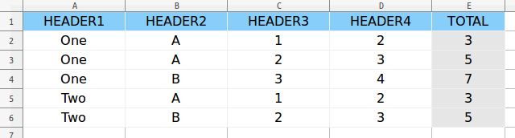

# tablereport


[](https://travis-ci.org/toaco/tablereport)
[](https://coveralls.io/github/toaco/tablereport?branch=master)
[](https://landscape.io/github/toaco/tablereport/master)

A python library for making table report. Now supports exporting to Excel.


## Install 

```python
pip install git+https://github.com/DevineLiu/tablereport.git@master
```


## Example

### Basic


```python
from tablereport import Table
from tablereport.shortcut import write_to_excel

table = Table(header=[['HEADER1', 'HEADER2', 'HEADER3', 'HEADER4']],
              body=[['One', 'A', 1, 2],
                    ['One', 'A', 2, 3],
                    ['One', 'B', 3, 4]])

write_to_excel('basic.xlsx', table)
```

### Style



```python
from tablereport import Table, Style
from tablereport.shortcut import write_to_excel

table_style = Style({
    'background_color': 'fff0f0f0',
})
title_style = Style({
    'background_color': 'ff87cefa',
    'font_weight': 'blod'
}, extend=table_style)

header_style = Style({
    'background_color': 'ff87cefa',
}, extend=table_style)
table = Table(header=[[('TEST', title_style), None, None, None],
                      [('HEADER1', header_style),
                       ('HEADER2', header_style),
                       ('HEADER3', header_style),
                       ('HEADER4', header_style)]],
              body=[['One', 'A', 1, 2],
                    ['One', 'A', 2, 3],
                    ['One', 'B', 3, 4]],
              style=table_style)

write_to_excel('style.xlsx', table)
```

### Column Selector


```python
from tablereport import Table, ColumnSelector, Style
from tablereport.shortcut import write_to_excel

table = Table(header=[['HEADER1', 'HEADER2', 'HEADER3', 'HEADER4']],
              body=[['One', 'A', 1, 2],
                    ['One', 'A', 2, 3],
                    ['One', 'B', 3, 4]])

style = Style({
    'background_color': 'fff0f0f0',
})
areas = table.body.select(ColumnSelector(lambda col: col % 2))
areas.set_style(style)
write_to_excel('column_selector.xlsx', table)
```

### Row Selector



```python
from tablereport import Table, RowSelector, Style
from tablereport.shortcut import write_to_excel

header_style = Style({
    'background_color': 'FF87CEFA',
})
even_row_style = Style({
    'background_color': 'FFF0F0F0',
})

table = Table(header=[['HEADER1', 'HEADER2', 'HEADER3', 'HEADER4']],
              body=[['One', 'A', 1, 2],
                    ['One', 'A', 2, 3],
                    ['One', 'B', 3, 4],
                    ['One', 'B', 1, 2], ])

table.header.set_style(header_style)
rows = table.body.select(RowSelector(lambda line: not line % 2))
rows.set_style(even_row_style)
write_to_excel('row_selector.xlsx', table)
```

### Cell Selector



```python
from tablereport import Table, Style, ColumnSelector, CellSelector
from tablereport.shortcut import write_to_excel

good_score_style = Style({
    'background_color': 'ff00cc33',
})
bad_score_style = Style({
    'background_color': 'ffcc0000',
})

table = Table(header=[['HEADER1', 'HEADER2', 'HEADER3', 'HEADER4']],
              body=[['One', 'A', 90, 70],
                    ['One', 'A', 50, 40],
                    ['One', 'B', 93, 59],
                    ['Two', 'A', 78, 23],
                    ['Two', 'B', 28, 66]])
area = table.body.select(ColumnSelector(lambda col: col == 3, width=2)).one()
good_score_cells = area.select(CellSelector(lambda cell: cell.value >= 90))
bad_score_cells = area.select(CellSelector(lambda cell: cell.value < 60))
good_score_cells.set_style(good_score_style)
bad_score_cells.set_style(bad_score_style)
```

### Merge


```python
from tablereport import Table, ColumnSelector
from tablereport.shortcut import write_to_excel

table = Table(header=[['HEADER1', 'HEADER2', 'HEADER3', 'HEADER4']],
              body=[['One', 'A', 1, 2],
                    ['One', 'A', 2, 3],
                    ['One', 'B', 3, 4]])

column = table.body.select(ColumnSelector(lambda col: col == 1)).one()
column.merge()
write_to_excel('merge.xlsx', table)
```

### Group



```python
from tablereport import Table, ColumnSelector
from tablereport.shortcut import write_to_excel

table = Table(header=[['HEADER1', 'HEADER2', 'HEADER3', 'HEADER4']],
              body=[['One', 'A', 1, 2],
                    ['One', 'A', 2, 3],
                    ['One', 'B', 3, 4],
                    ['Two', 'A', 1, 2],
                    ['Two', 'B', 2, 3]])

column = table.body.select(ColumnSelector(lambda col: col == 1)).one()
column.group().merge()
write_to_excel('group.xlsx', table)
```

### Summary



```python
from tablereport import Table, Style
from tablereport.shortcut import write_to_excel

table = Table(header=[['HEADER1', 'HEADER2', 'HEADER3', 'HEADER4']],
              body=[['One', 'A', 1, 2],
                    ['One', 'A', 2, 3],
                    ['One', 'B', 3, 4]])

style = Style({
    'background_color': 'ffe6e6e6',
})
table.body.summary(label='Total', label_span=2, label_style=style,
                   value_style=style)
write_to_excel('summary.xlsx', table)
```

### Horizontal Summary



```python
from tablereport import Table, Style, ColumnSelector
from tablereport.shortcut import write_to_excel

table = Table(header=[['HEADER1', 'HEADER2', 'HEADER3', 'HEADER4']],
              body=[['One', 'A', 1, 2],
                    ['One', 'A', 2, 3],
                    ['One', 'B', 3, 4],
                    ['Two', 'A', 1, 2],
                    ['Two', 'B', 2, 3]])

header_style = Style({
    'background_color': 'ff87cefa',
})
summary_style = Style({
    'background_color': 'ffe6e6e6',
})

areas = table.select(ColumnSelector(lambda col: col == 3, width=2))
summary_style = Style({
    'background_color': 'ffe6e6e6',
})
areas.summary(label_span=1, label='TOTAL', location='right',
              value_style=summary_style, label_style=header_style)
table.header.set_style(header_style)
write_to_excel('horizontal_summary.xlsx', table)
```

### Complex


```python
from tablereport import Table, ColumnSelector, Style
from tablereport.shortcut import write_to_excel

title_style = Style({
    'font_size': 15,
    'background_color': 'ff87cefa',
    'font_weight': 'blod'
})

header_style = Style({
    'background_color': 'ff87cefa',
})

left_total_style = Style({
    'background_color': 'fff0f0f0',
})

bottom_total_style = Style({
    'background_color': 'ffe6e6e6',
})

table = Table(header=[['TEST', None, None, None],
                      ['HEADER1', 'HEADER2', 'HEADER3', 'HEADER4']],
              body=[['One', 'A', 1, 2],
                    ['One', 'A', 2, 3],
                    ['One', 'B', 3, 4],
                    ['Two', 'A', 1, 2],
                    ['Two', 'B', 2, 3]])

table.header[0].set_style(title_style)
table.header[1].set_style(header_style)

column = table.body.select(ColumnSelector(lambda col: col == 1)).one()
column.group().merge().left.summary(label_span=1, label='Total',
                                    label_style=left_total_style,
                                    value_style=left_total_style)

table.summary(label_span=2, label='Total',
              label_style=bottom_total_style,
              value_style=bottom_total_style)

write_to_excel('complex.xlsx', table)
```
